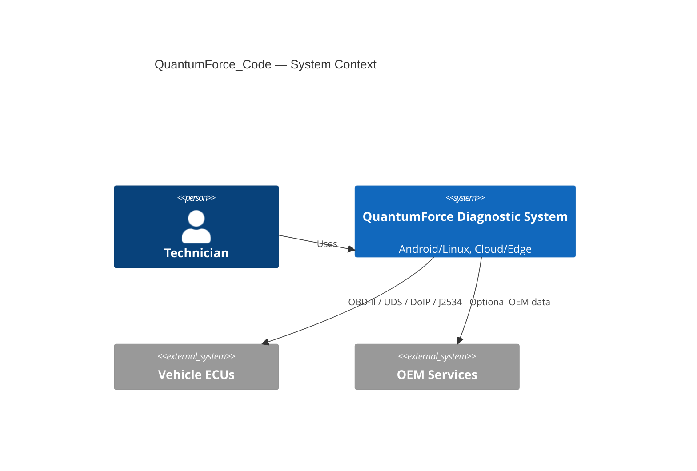

# Архітектурний огляд

## Високорівнева схема (C4: System Context)


## Модулі
- UI Shell (Android/Linux, cross-platform)
- Protocol Adapters (OBD-II, CAN-UDS, DoIP, J2534)
- Transport (ISO-TP, TCP/UDP)
- Data Layer (DTC, PID store, time-series)
- Plugin Engine (extensions)
- Cloud Sync (optional), Edge Processing
- Security & Compliance (GDPR, ISO 26262)

## API контракти (приклад)
```yaml
readDataByIdentifier:
  request:
    did: string
    timeoutMs: number
  response:
    dataHex: string
    p2Ms: number
  errors:
    - timeout
    - negativeResponse
```

## Техстек
- Kotlin/Java (Android), Python/Go (edge services)
- MkDocs Material (docs), GitHub Actions (CI)
- Mermaid (діаграми)

## Масштабування і безпека
- Плагіни ізольовані, контроль ресурсів
- Безпечні сховища ключів, політики доступу
- Логи з мінімізацією персональних даних
