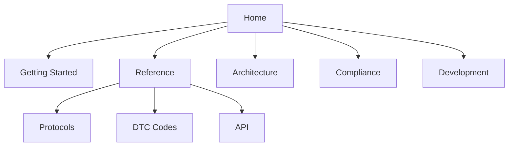

# Docs Navigator

Карти розділів і швидкі маршрути для людей і ШІ-агентів.

## Карта сайтмапу

## Шаблони пошуку
- "PID timing site:reference/protocols"
- "ASIL-D safety site:safety"
- "GDPR site:compliance"

## Перехресні посилання
- Глосарій: `glossary.md`
- ADR: `architecture/decisions/`
- Безпека: `compliance/iso-26262.md`
