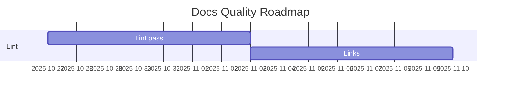

# Метрики якості документації

## KPI
- Markdown lint pass rate: 100%
- Broken links: 0
- AI content review coverage: 100%
- Time to review: < 24h
- Docs coverage: > 90%

## Дашборд (приклад)

## Процес
1) PR відкрито → CI перевірки
2) Людська рецензія 2+
3) Semantic release оновлює CHANGELOG
